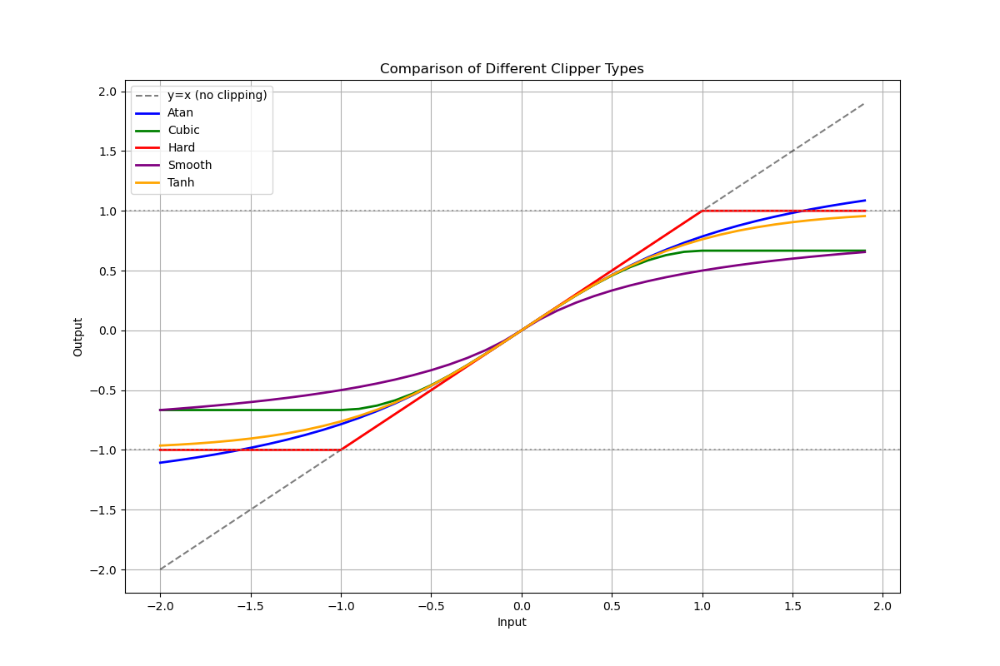

# JClipper

Practice code for implementing a clipper in C++

## Build

Build all clippers

```bash
make all
```

# User Guide

## Input and Output

### PIPE

Process streams with clipper using PIPE to another file. ✅

```bash
cat wav/input.wav | compiled/clipper - > output.wav
```

Process streams with clipper using PIPE to a audio player such as play. ✅

```bash
cat wav/input.wav | compiled/clipper - | play -t wav -
```

## Clipper Type

Clip a wav file using different clipping types.

```bash
compiled/clipper --type hard --input-file input.wav --output-file output.wav
compiled/clipper --type smooth --input-file input.wav
```



## Gain compensation

Specify Input and Output Gain to drive the distortion and compensate output level afterwards.

```bash
cat wav/input.wav | compiled/clipper --type smooth --input-gain 9.0 - > wav/output.wav
```


```bash
comp --threshold '-18' --ratio 4 --attack 0.3 --release 0.1 | 
eq --hpf-freq 30hz --lpf-f3req 12khz | 
clipper --type hard --input-gain 10db --output-gain '-10db' > out.wav
```